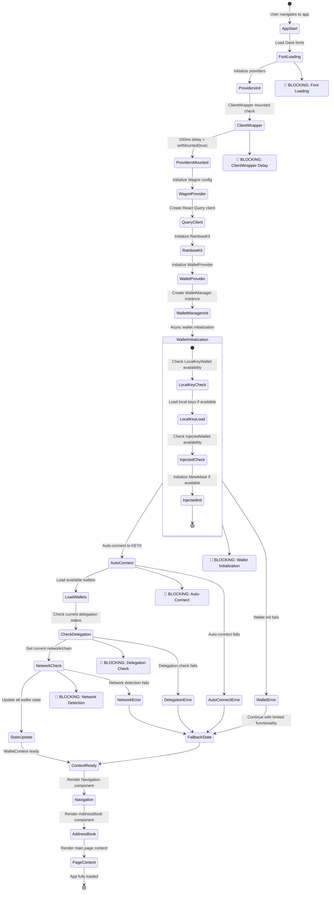

# Web App Loading Performance Analysis

## State Diagram: Blocking Matters During App Loading



## Key Blocking Issues Identified

### 1. **Sequential Provider Initialization** 🔴
- **Issue**: All providers initialize sequentially, not in parallel
- **Impact**: Each provider must wait for the previous one to complete
- **Location**: `src/lib/providers.tsx`

### 2. **ClientWrapper Artificial Delay** 🔴
- **Issue**: 100ms artificial delay in ClientWrapper
- **Impact**: Blocks all rendering for 100ms
- **Location**: `src/components/layout/ClientWrapper.tsx:11-13`

### 3. **Wallet Manager Synchronous Initialization** 🔴
- **Issue**: WalletManager constructor starts async initialization but blocks on `waitForInitialization()`
- **Impact**: All wallet operations wait for full initialization
- **Location**: `src/lib/wallets/wallet-manager.ts:15-18`

### 4. **Auto-Connect Blocking** 🔴
- **Issue**: Auto-connect to KEY0 happens synchronously on mount
- **Impact**: Blocks UI until wallet connection completes
- **Location**: `src/contexts/WalletContext.tsx:106-128`

### 5. **Delegation Check Blocking** 🔴
- **Issue**: Immediate delegation check after connection
- **Impact**: Additional network calls block state updates
- **Location**: `src/contexts/WalletContext.tsx:139-153`

### 6. **Multiple useEffect Dependencies** 🔴
- **Issue**: Complex dependency chains causing multiple re-renders
- **Impact**: State updates trigger cascading effects
- **Location**: `src/contexts/WalletContext.tsx:520-538`

### 7. **Heavy Dependencies** 🔴
- **Issue**: Large libraries loaded synchronously
- **Impact**: Bundle size affects initial load time
- **Dependencies**:
  - `@rainbow-me/rainbowkit` (2.2.8)
  - `@zerodev/sdk` (5.4.41)
  - `wagmi` (2.16.3)
  - `viem` (2.34.0)

## Performance Optimization Recommendations

### Immediate Fixes (High Impact)
1. **Remove ClientWrapper delay** - Eliminate 100ms artificial delay
2. **Parallel provider initialization** - Initialize providers concurrently
3. **Lazy load heavy components** - Load AddressBook and Navigation on demand
4. **Optimize wallet initialization** - Make wallet loading non-blocking

### Medium-term Improvements
1. **Code splitting** - Split wallet providers into separate chunks
2. **Preload critical resources** - Preload fonts and essential assets
3. **Optimize bundle size** - Tree-shake unused dependencies
4. **Implement progressive loading** - Show skeleton UI while loading

### Long-term Optimizations
1. **Service worker caching** - Cache wallet states and configurations
2. **Background initialization** - Initialize non-critical features in background
3. **State management optimization** - Reduce context re-renders
4. **Network optimization** - Batch network requests and implement retry logic

## Current Loading Sequence Timeline

```
0ms     - App starts, fonts begin loading
100ms   - ClientWrapper delay completes
200ms   - Providers initialize sequentially
500ms   - WalletManager initialization
800ms   - Auto-connect attempt
1200ms  - Delegation check
1500ms  - Network detection
1800ms  - Final state update
2000ms  - App fully interactive
```

**Total blocking time: ~2000ms**
